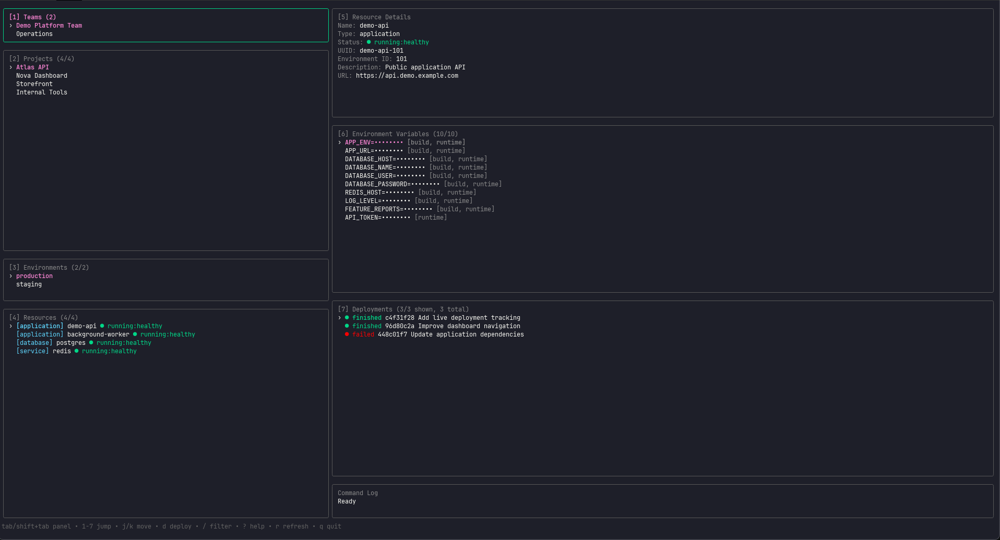

# coolify-tui

[](https://github.com/micaelmcarvalho/coolify-tui/releases)
[](https://go.dev/)
[](LICENSE)

A Lazygit-inspired terminal dashboard for exploring and deploying applications on [Coolify](https://coolify.io).

Browse teams, projects, environments, resources, environment variables, deployments, and live deployment logs without leaving your terminal.

> This is an independent community project and is not officially affiliated with or maintained by Coolify.

## Preview



Explore the interface safely with offline example data:

```sh
coolify-tui demo
```

Demo mode does not require a Coolify URL or API token and never contacts a Coolify server.

## Features

- Lazygit-style multi-panel interface
- Browse Coolify teams and projects
- Navigate project environments and resources
- View application status and details
- View application environment variables
- Environment-variable values masked by default
- Filter projects, environments, resources, variables, and deployments
- View deployment history
- View deployment details and logs
- Scroll through deployment logs
- Trigger application deployments with explicit confirmation
- Follow deployment status and logs automatically
- Pause and resume automatic log following
- Keyboard help popup
- Safe offline demo mode
- macOS, Linux, and Windows release builds
- Homebrew installation for macOS

## Installation

### Homebrew

Install the latest release on macOS:

```sh
brew install --cask micaelmcarvalho/tap/coolify-tui
```

Configure the application:

```sh
coolify-tui configure
```

Then start it:

```sh
coolify-tui
```

Upgrade to the latest release:

```sh
brew update
brew upgrade --cask coolify-tui
```

Uninstall:

```sh
brew uninstall --cask coolify-tui
```

### Using Go

Go 1.24 or newer is required.

Install directly from GitHub:

```sh
go install github.com/micaelmcarvalho/coolify-tui/cmd/coolify-tui@latest
```

Make sure the Go binary directory is available in your `PATH`:

```sh
export PATH="$PATH:$(go env GOPATH)/bin"
```

Then run:

```sh
coolify-tui
```

### GitHub releases

Download the archive for your operating system and architecture from the [GitHub Releases page](https://github.com/micaelmcarvalho/coolify-tui/releases).

On macOS or Linux, extract the archive and install the binary:

```sh
chmod +x coolify-tui
sudo mv coolify-tui /usr/local/bin/
```

Verify the installation:

```sh
coolify-tui version
```

### From source

```sh
git clone https://github.com/micaelmcarvalho/coolify-tui.git
cd coolify-tui

go build -o coolify-tui ./cmd/coolify-tui
./coolify-tui
```

## macOS security

The project currently distributes unsigned community builds. macOS may prevent the application from opening because it cannot verify the developer.

If this happens, open:

```text
System Settings → Privacy & Security
```

Find the blocked `coolify-tui` message and choose **Open Anyway**.

Only bypass this warning when you trust the repository and downloaded release. Apple code signing and notarization are planned for a future release.

## Configuration

The easiest way to configure the application is:

```sh
coolify-tui configure
```

You will be prompted for:

- Your Coolify URL
- Your Coolify API token

Example:

```text
Coolify URL: https://coolify.example.com
Coolify API token:
Configuration saved to ...
```

The API token remains hidden while you type or paste it.

After configuration, start the dashboard:

```sh
coolify-tui
```

### Configuration file

The configuration is stored in your operating system's user configuration directory.

Typical locations are:

| Operating system | Location |
| --- | --- |
| macOS | `~/Library/Application Support/coolify-tui/config.json` |
| Linux | `~/.config/coolify-tui/config.json` |
| Windows | `%AppData%\coolify-tui\config.json` |

On macOS and Linux, the configuration file is restricted to the current user.

The file contains the Coolify URL and API token. Treat it as sensitive and never commit it to Git.

### Environment variables

Environment variables can be used instead of the saved configuration:

```sh
export COOLIFY_URL="https://coolify.example.com"
export COOLIFY_TOKEN="your-api-token"

coolify-tui
```

### Local `.env` file

A local `.env` file is supported during development:

```dotenv
COOLIFY_URL=https://coolify.example.com
COOLIFY_TOKEN=your-api-token
```

Run the application from the directory containing the file:

```sh
coolify-tui
```

Make sure `.gitignore` contains:

```gitignore
.env
.env.*
!.env.example
```

Never commit `.env` files or API tokens.

### Configuration priority

The application uses the following priority:

1. Exported environment variables
2. Values from a local `.env` file
3. Values saved by `coolify-tui configure`

If a newly configured token does not appear to work, check whether an older `COOLIFY_TOKEN` is still exported:

```sh
if [ -n "$COOLIFY_TOKEN" ]; then
  echo "COOLIFY_TOKEN is exported"
fi
```

## API token permissions

Create an API token from the Coolify dashboard.

For access to every currently supported feature, use:

```text
read
read:sensitive
deploy
```

| Permission | Used for |
| --- | --- |
| `read` | Teams, projects, environments, resources, and deployments |
| `read:sensitive` | Environment variables and deployment logs |
| `deploy` | Starting application deployments |

The application does not require `write` or `root`.

Coolify API tokens are scoped to the team that was active when the token was created. Create the token while the appropriate team is selected.

See the [Coolify API authorization documentation](https://coolify.io/docs/api-reference/authorization) for more information.

## Usage

Start the dashboard:

```sh
coolify-tui
```

The dashboard contains seven panels:

1. Teams
2. Projects
3. Environments
4. Resources
5. Resource Details
6. Environment Variables
7. Deployments

Selecting a project loads its environments. Selecting an environment loads its resources. Selecting an application loads its environment variables and deployment history.

## Starting a deployment

Select an application and press:

```text
d
```

A confirmation popup displays:

- Application name
- Project
- Environment
- Git branch
- Whether a forced rebuild is requested

Confirm with `y` or `Enter`.

Cancel with `n` or `Esc`.

After confirmation, the application opens the deployment-details screen and refreshes its status and logs every two seconds.

Polling continues while the deployment is queued or running and stops after it finishes, fails, or is cancelled.

## Deployment log following

New log lines are followed automatically.

- Press `k` or `↑` to scroll upward and pause automatic following.
- Polling continues while log following is paused.
- Press `G` or `End` to return to the bottom and resume following.
- Press `Esc` to close deployment details and stop polling.
- Press `r` for an immediate manual refresh.

## Demo mode

Run the dashboard using safe, offline example data:

```sh
coolify-tui demo
```

When running from source:

```sh
go run ./cmd/coolify-tui demo
```

Demo mode includes:

- Fake teams
- Fake projects and environments
- Applications, databases, and services
- Fake environment variables
- Deployment history
- Deployment logs
- A simulated deployment that progresses from queued to running to finished

Demo mode never reads your Coolify configuration or contacts a Coolify instance.

It is useful for:

- Trying the interface before configuring Coolify
- Taking screenshots
- Testing terminal themes and dimensions
- Demonstrating the project without exposing private data

## Keyboard shortcuts

### Navigation

| Key | Action |
| --- | --- |
| `Tab` | Focus the next panel |
| `Shift+Tab` | Focus the previous panel |
| `1`–`7` | Focus a specific panel |
| `j` / `↓` | Move down |
| `k` / `↑` | Move up |
| `g` / `Home` | Select the first item |
| `G` / `End` | Select the last item |
| `Enter` | Open an item or focus the next panel |
| `Esc` | Go back or clear an active filter |
| `r` | Refresh the active panel |
| `q` / `Ctrl+C` | Quit |

### Application actions

| Key | Action |
| --- | --- |
| `d` | Open deployment confirmation |
| `v` | Reveal or hide environment-variable values |
| `r` | Refresh the active panel |

Environment-variable values are hidden by default.

Be careful when revealing values. Secrets can remain visible in terminal scrollback, screenshots, screen sharing, or screen recordings.

### Filtering

| Key | Action |
| --- | --- |
| `/` | Start or edit a panel filter |
| `Enter` | Accept the filter |
| `Esc` | Cancel or clear the filter |
| `Ctrl+U` | Clear the filter input |

Filtering is available for:

- Projects
- Environments
- Resources
- Environment variables
- Deployments

### Deployment list

| Key | Action |
| --- | --- |
| `n` | Load the next deployments page |
| `p` | Load the previous deployments page |
| `Enter` | Open the selected deployment |
| `r` | Refresh deployment history |

### Deployment details

| Key | Action |
| --- | --- |
| `j` / `↓` | Scroll logs down |
| `k` / `↑` | Scroll logs up and pause following |
| `g` / `Home` | Jump to the beginning of the logs |
| `G` / `End` | Jump to the end and resume following |
| `r` | Refresh immediately |
| `Esc` | Return to the dashboard and stop polling |
| `q` / `Ctrl+C` | Quit |

### Help

| Key | Action |
| --- | --- |
| `?` | Open or close keyboard help |
| `Esc` | Close keyboard help |

## Version information

Display the installed version:

```sh
coolify-tui version
```

The command also accepts:

```sh
coolify-tui --version
coolify-tui -v
```

Release builds display the version, commit, and build date.

## Terminal requirements

- A terminal with color support
- A recommended minimum size of `80x24`

The layout automatically adapts to the available terminal dimensions.

## Development

Clone the repository:

```sh
git clone https://github.com/micaelmcarvalho/coolify-tui.git
cd coolify-tui
```

Download dependencies:

```sh
go mod download
```

Run with a real Coolify instance:

```sh
go run ./cmd/coolify-tui configure
go run ./cmd/coolify-tui
```

Run with offline demo data:

```sh
go run ./cmd/coolify-tui demo
```

Run the project checks:

```sh
go fmt ./...
go vet ./...
go test ./...
```

Build a local binary:

```sh
go build -o coolify-tui ./cmd/coolify-tui
```

Validate the release configuration:

```sh
goreleaser check
goreleaser release --snapshot --clean
```

## Capturing a screenshot

Run demo mode:

```sh
go run ./cmd/coolify-tui demo
```

Create the image directory if necessary:

```sh
mkdir -p docs/images
```

Capture only the terminal dashboard and save the image as:

```text
docs/images/dashboard.png
```

Avoid including:

- Your desktop
- Your username or home directory
- Real project names
- API tokens
- Environment-variable values
- Private deployment logs
- Unrelated terminal tabs or notifications

## Project structure

```text
cmd/coolify-tui/       Application entry point and version command
internal/config/       Configuration loading and storage
internal/coolify/      Coolify API client, response types, and demo client
internal/ui/           Bubble Tea interface, filtering, panels, and popups
docs/images/           README screenshots and other documentation images
```

## Security

- Use the least-privileged Coolify token possible.
- Treat the saved configuration file as sensitive.
- Never commit API tokens or `.env` files.
- Do not pass tokens as command-line arguments.
- Avoid revealing environment-variable values during screen sharing.
- Review the application, project, environment, and branch before confirming a deployment.
- Deployment actions always require explicit confirmation.
- Hidden Coolify log entries are not displayed.
- Revoke and replace any token that may have been exposed.
- Keep the application and Coolify installation updated.

## Roadmap

- Multiple Coolify profiles
- Multiple team-specific tokens
- Application runtime logs
- Copy UUIDs and safe values to the clipboard
- Apple code signing and notarization
- Optional operating-system keychain integration
- Cancel active deployments
- Restart application action with confirmation
- Optional forced rebuild during deployment
- Improved responsive layouts for small terminals
- Automated screenshot and demo recording generation

## Contributing

Issues and pull requests are welcome.

Before submitting a pull request, run:

```sh
go fmt ./...
go vet ./...
go test ./...
```

When reporting a bug, include:

- Operating system
- Terminal application
- Coolify version
- `coolify-tui version` output
- Steps required to reproduce the problem

Never include API tokens, environment-variable values, or private deployment logs in bug reports.

## License

Released under the [MIT License](LICENSE).
